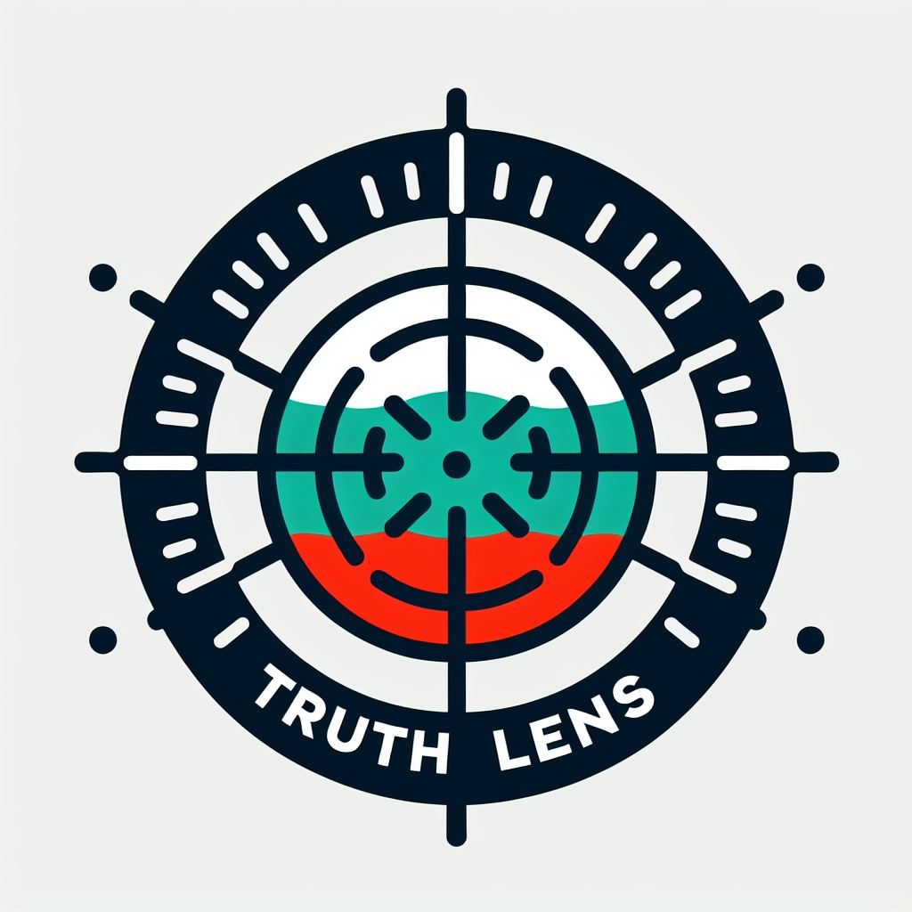

# TruthLens: A News Headline Credibility Analyzer

# About
TruthLens is an open-source project that aims to analyze the credibility of Bulgarian news headlines. It provides a tool for evaluating the reliability and accuracy of news articles based on their titles. By assessing various factors, TruthLens helps users make informed decisions about the information they consume.

# Features
- **Credibility Assessment for Bulgarian Titles**: TruthLens specializes in analyzing the credibility of Bulgarian news headlines. It employs [Logistic Regression](https://www.geeksforgeeks.org/understanding-logistic-regression/) to evaluate the trustworthiness of titles from Bulgarian news sources.
- **User-Friendly Interface**: The web-based interface allows users to input Bulgarian news headlines and receive credibility scores. The results are presented in an intuitive format.
